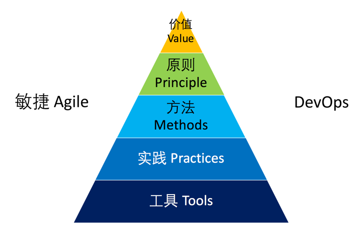

.. _rst_devops-training

DevOps敏捷开发培训计划
====================

.. |stub-icon| unicode:: U+1F527

.. attention::
    
    本文档使用reST格式编写，内容托管于GitHub。文档内容正在持续编写中，所有标注为 |stub-icon| 的部分表示还未编写完毕，如果您在使用中遇到问题，可以通过我们的 coding.net讨论组_ 来提交问题。

概述
-----

DevOps将产品研发，部署，监控／分析，运维和运营串接起来，整合为一体化产品生命周期过程。DevOps的价值在于通过体系化的方法，工具，实践来改善产品的质量，帮助您更好的把握用户需求并最终创造商业价值。本培训课程覆盖了DevOps的价值，原则，方法，时间和工具五个层面，让你和你的团队对于实施DevOps所涉及的内容进行全面了解。

本培训希望通过引导和启发式的讨论和您一起探寻DevOps所涉及的五个层面内容，结合您的团队的实际情况，与您一同规划最适合你的团队的DevOps转型路线图。

适用对象
--------

DevOps的涉及面很广，需要组织中各种不同的角色和部门相互配合才能推动。

:更新日期: |today|
:作者: **徐磊** 
:主页: `DevOps Hub <http://devopshub.cn>`_

内容
-----

.. toctree::
    :titlesonly:
    
    agenda/index

